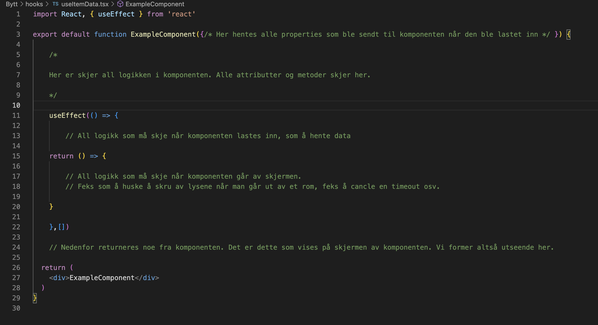
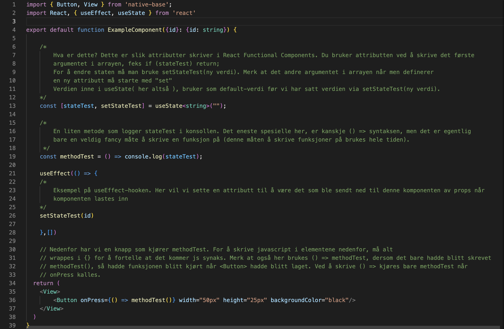

# React kickstart

## Forkunnskaper

For å lære React burde man ha litt
kjennskap til:

- HTML/CSS
- Javascript

## Hva er HTML/CSS

## Smakebit

React har gode guides på nettsiden deres, anbefales å **lese de**.
React er bygget opp rundt **komponenter**.

Ovenfor ser man en slags "template" til en react-komponent (jeg slang den sammen litt raskt, men det er ish sånn komponentene pleier å se ut). Disse komponentene kan ansees å være analogt med klasser i Java. En komponent har attributter og metoder som en java-klasse, men i tillegg har den også
**JSX**. Det er i JSX man lager elementene som vises på skjermen, og de ser du i return( JSX ) i screenshottet ovenfor. Nedenfor ser ut et eksempel der jeg putta inn noe kode for å vise


## Basics

I React har man erstattet klasser med **functional components**, der man abstraherer bort ideen av en klasse, så komponentene (klassene) ser kanskje ikke helt ut som det man er vant til fra Java/Python.

### States/attributes

Fra Java eller Python klasser er man kanskje vant til å skrive attributter slik:

> `private String state = "noe";`

eller

> `self.state = "noe"`

I React Functional Components er dette erstattet med å skrive:

> `const [state, setState] = useState();`

Her lager vi attributten, samtidig som vi lager en getter og setter!. Vi kan hente ut verdien til _state_ direkte ved å bare bruke navnet _state_ der vi vil bruke attributten,

> `console.log(state)`

og endre verdien ved å bruke funksjonen

> `setState(/* Her setter du den nye verdien */)`

Dersom vi ønsker å ha en "default-value" for en attributt, så velges dette her:

> `const [state, setState] = useState(/* Dette er default value */);`

---

## Metoder

Metodene brukes på samme måte som ellers i vanlige klasser. Det eneste snodige her er kanskje hvordan man skriver funksjonene, da konvensjonen er å skrive såkalte arrow-functions. De ser slik ut:

```javascript
const minCamelCaseFunksjon = () => {
    // Gjør noe
}

som er ekvivalent med:

function minCamelCaseFunksjon(){
    // Gjør noe
}

```

## Hooks

Hooks er litt vanskelig å forstå i starten, men det er hovedsakelig én man trenger å forholde seg til i starten:

> `useEffect`

Denne _hooken_ er en funksjon som kjøres når komponenten lastes inn, og når komponenten blir tatt av skjermen. Hva skal vi med dette?

Real-life eksempel: Når vi kommer hjem er d ofte fler ting vi vil gjøre. Kanskje sette på varme, sette på plass ting vi har kjøpt mens vi har ute osv. Dette er analogt med det som skal skje i komponenten når det lastes inn. Når vi drar fra huset, må vi passe på at stekeovnen er av og slått av lysene. Dette er analogt med hva som skal skje når komponenten tas av skjermen.

### Henting av data

Hvis komponenten trenger data fra en database, er det her man kjører den prosessen. Da vil henting av data skje så snart komponenten lastes inn. Hvis vi setter opp en "listener" på dataen, så vil vi gjerne fjerne denne forbindelsen når vi ikke bruker komponenten, slik at det ikke står på i bakgrunnen og ødelegger ytelsen til applikasjonen

## JSX

Dette er det som er i

> return(
>
> );

av en functional component. Her kommer alt som skal vises på skjermen i form av enten Native elements (mobil) eller browser elements (web). Dette vil foreksempel vise en horisontal rekke av knapper:

```javascript
return (
  <HStack>
    <Button />
    <Button />
    <Button />
  </HStack>
);
```

Man vil gjerne at disse elementene skal kommunisere med logikken i komponenten. Dette gjøres for eksempel ved at Button har en "onPress" property. Dvs at Button kan kalle på en metode/funksjon i logikk-delen av komponenten. Hvis vi har en metode som heter "getData()" som vi vil kalle med en av knappene, kan de se slik ut:

```javascript
return (
  <HStack>
    <Button onPress={() => getData()} />
    <Button />
    <Button />
  </HStack>
);
```

For å skrive javascript i JSX må vi pakke inn all javascript syntax i "{}". Man må også skrive

> () => getData()

for at funksjonen kun skal kjøre når knappen blir trykket på. Ellers vil funksjonen bli kjørt én gang når knappen blir laget av JSX, også skjer det ikke noe mer. Derimot kan vi skrive () => for å definere en anonym, ny funksjon når JSX'en blir laget slik at den kun kjøres når onPress blir aktivert på knappen.
<<<<<<< HEAD

## Props

Props er noe en _parent_ komponent kan gi til en _child_. Dette er lettere å vise ved et eksempel:

La oss si du først laget en komponent, Box, som har en farge, som det står "Hei" i.

```javascript
export default function Boks({ color }) {
  return <View bg={color}>Hei</View>;
}
```

Her ser vi at komponenten tar inn _{color}_, en property som komponenten blir gitt av en parent. Fargen til boksen varierer altså avhengig av "color"

Så lager vi parent, som vi kaller App:

```javascript
export default function App({ color }) {
  return <Boks color="blue" />;
}
```
